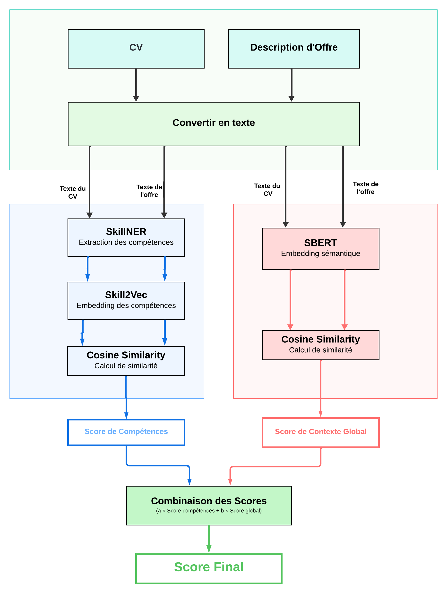

# 🧠 Hybride Matching CV - Offres d’Emploi

Ce projet propose une **approche hybride** intelligente pour le *matching sémantique* entre des **CVs** et des **offres d’emploi**.  
Elle combine deux dimensions complémentaires :

- Une **analyse sémantique globale** des documents grâce à **SBERT** (Sentence-BERT),
- Une **représentation vectorielle fine des compétences** à l’aide de **Skill2Vec**, avec extraction automatique via **SkillNER**.

Cette combinaison permet un appariement plus **pertinent**, **flexible** et **contextuel**, en tenant compte à la fois du sens global et des compétences clés.

---

## 🏗️ Architecture Générale

Voici un aperçu de l’architecture du système :



---

## 🔍 Approche Hybride

L'approche repose sur **trois grandes briques** principales :

### 1. **Extraction des Compétences (SkillNER)**
- Identification automatique des compétences techniques et non techniques à partir de textes bruts.
- Permet d’isoler les compétences des CVs et des offres d’emploi comme base de comparaison vectorielle.

### 2. **Skill2Vec – Représentation Vectorielle des Compétences**
- Modèle de type **Word2Vec** entraîné sur des séquences de compétences extraites.
- Chaque compétence est projetée dans un espace vectoriel sémantique.
- Cela permet de détecter des similarités même en cas de synonymie ou variation de vocabulaire.

### 3. **Matching Sémantique Global (SBERT)**
- Le texte complet du CV et de l’offre d’emploi est encodé via **SBERT**, pour capturer la signification globale.
- Cela complète l’analyse fine par compétences avec une dimension contextuelle plus large.

### ➕ (Optionnel) Matching Symbolique
- Possibilité d’ajouter des règles métier, des pondérations ou du matching exact pour affiner les résultats dans des cas spécifiques.


---


## 📦 Modèle SBERT 

(à venir)


## 📦 Modèle Skill2Vec

Le cœur du système est le Modèle `Skill2VecMatching`, qui encapsule tout le processus d’extraction, vectorisation et matching de compétences.

📄 Pour comprendre son fonctionnement en détail, consultez la documentation :  
[`Skill2Vec/docs.md`](Skill2Vec/docs.md)


---

## ▶️ Exemple d’Utilisation de skill2vec 

Pour utiliser le modèle de compétences (Skill2Vec), vous pouvez utiliser cette classe `Skill2VecMatching`:

```python
from Skill2VecMatching import Skill2VecMatching

# Instanciation du Modèle avec les fichiers CV et offre d’emploi
competence_Model = Skill2VecMatching("cv.pdf", "job.txt")

# Obtention du score de similarité
score = competence_Model.get_similarity_score()

print(f"Score de similarité : {score}")

```


> Un module dédié à la compréhension contextuelle complète des documents sera intégré prochainement. Il permettra de moduler l’analyse selon le domaine métier ou le poste visé.


